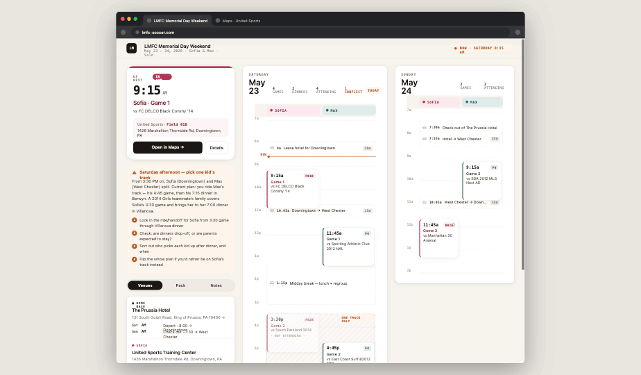

# Handoff — LMFC Weekend HQ redesign



## Overview

This is a redesign of the single-page tournament itinerary at **schmidtfam-soccer/index.html** (a GitHub-Pages-hosted static site). The current site is correct but text-dense; the goal of this redesign is to keep every piece of information while drastically reducing the cognitive load when a parent is using it on the sideline with one hand.

The website is for **one tournament weekend** — Sat May 23 + Sun May 24, 2026. Two kids (Sofia, Max), two venues, one solo parent. It needs to read well on a phone (primary use case during the day) and on a laptop (used the night before for planning).

---

## About the design files

The files in `prototype/` are **design references built in HTML+React+Babel** — they are *prototypes*, not production code to copy directly. They render inside a Figma-style design canvas with an iPhone frame and a browser frame so the look-and-feel is clear.

The current production site is a **single static HTML file** (vanilla HTML/CSS/JS, no build step, deployed to GitHub Pages with a custom CNAME). The implementation task is to **recreate the prototype's design as a single static HTML file** — same tech stack as the current `schmidtfam-soccer/index.html`, no React, no build pipeline, no external dependencies beyond a Google Fonts link. The output should be a drop-in replacement for the current `index.html`.

Open `prototype/index.html` locally (or in the design tool) to see the live, interactive reference.

---

## Fidelity

**High-fidelity.** Final colors, typography, spacing, copy, and interactions are decided. The coding agent should match these values exactly.

---

## Target tech stack (matches existing site)

- Single `index.html` file
- Vanilla HTML / CSS / JS (no framework, no bundler, no transpiler)
- One external resource: Google Fonts (Geist + Geist Mono) via `<link>` — same pattern as the current site's system-font reliance, but upgraded
- Must work offline once cached
- Must print cleanly (the current site has `@media print` — keep that)
- Deployed to GitHub Pages; CNAME is preserved by leaving the existing `CNAME` file untouched

---

## Screens / views

The redesigned product is **one page** with internal navigation (tabs on mobile, side-by-side layout on desktop). No router, no separate pages.

| Screen | Reference |
|---|---|
| Mobile · Saturday schedule | `screenshots/01-mobile-saturday.png` |
| Mobile · Sunday schedule | `screenshots/02-mobile-sunday.png` |
| Mobile · Venues | `screenshots/03-mobile-venues.png` |
| Mobile · Pack | `screenshots/04-mobile-pack.png` |
| Mobile · Notes | `screenshots/05-mobile-notes.png` |
| Desktop · Weekend overview | `screenshots/06-desktop-weekend.png` |

### 1. Schedule (default view, mobile)

The hero of the app.

**Layout (top → bottom):**

1. **Status header** (sticky-feeling, but doesn't need to be technically sticky)
   - Eyebrow row: monospace caps `LMFC · MEMORIAL DAY WEEKEND` (left), `2026` (right)
   - Day-of-week label: `Saturday` (muted, 13px, 500 weight)
   - Big date: `May 23` (30px, 600 weight, -0.8 tracking)
   - On the right, vertically aligned to the date: a pill-shaped two-day toggle: `Sat 23` / `Sun 24`. Active day = dark ink background, inactive = transparent.
   - Summary strip below: monospace caps `3 GAMES · 2 ATTENDING · 2 VENUES · 1 CONFLICT`. Numbers in solid ink, separators muted, conflict word in warm orange.

2. **Up Next card** (only renders if the simulated "now" falls on this day — see "Now logic" below)
   - Large rounded card (radius 22), warm-white surface, 1px hairline border, subtle shadow.
   - Left edge: 6px solid color bar in the kid's color (Sofia rose / Max teal).
   - Top-right corner: faint radial wash in the kid's tint color, ~200×200, low opacity (~65%).
   - Header row: muted caps `UP NEXT` + a colored pill showing `IN 40M` or `IN 1H 20M`.
   - Big time in monospace: `9:15` huge (30px, 600 weight, -1.2 tracking), `AM · 1h 30m` smaller below it.
   - To the right of the time: `Sofia · Game 1` (18px, 600, kid-color deep), `vs FC DELCO Black Conshy '14` (13.5px, ink2).
   - Venue badge: `📍 United Sports · Field 01B` in the kid's tint, with the field name in monospace.
   - Two buttons: solid dark `Directions →` (full width-ish) + outline `Details`.

3. **Hero actions** (collapsible cards — zero, one, or more per day)
   - Soft orange tinted card with hairline orange border.
   - Day has a `heroActions: [...]` array; render one card per item. (Back-compat: an older singular `heroAction` object is also accepted.)
   - Each card: warning icon + bold orange title + chevron header, collapsible.
   - When open: a paragraph of body, then a numbered step list. Numbers are 18px solid orange circles with white digits.
   - In the current data Saturday has one continuous “pick one kid’s track” play covering the afternoon + evening (game conflict + dinner conflict are treated as one decision). Sunday has none.

4. **Dual-lane timeline** — the centerpiece
   - Two parallel vertical lanes labeled `SOFIA` (rose) and `MAX` (teal).
   - Vertical time axis on the left edge (38px wide gutter), monospace hour labels every hour: `7a`, `8a`, `9a`, ..., `12p`, `1p`, ...
   - Hour gridlines span both lanes. Even hours = solid hairline, odd hours = dashed hairline.
   - Each lane header sits at the top of its column: small pill with a 8px colored dot + the kid’s name in monospace caps, on a tinted background.
   - **Vertical scale:** 1.5 px per minute on mobile, 1.2 px per minute on desktop. The Sat timeline runs 7 AM → 9 PM (14h, ~1260px on mobile), Sun runs 7 AM → 2 PM. Read `startHour` / `endHour` per day.
   - **Event cards** sit inside their lane column. Width = half the lane area minus gutters. White surface, hairline border in the kid’s bg color, 3px solid colored left edge, radius 10. There are two kinds:
     - `kind: 'game'` — top row: time + field code badge (`F01B`, `F4`, `D02A`). Subtitle: `Game N` in kid-color. Third line: `vs <short opponent>` (line-clamped to 2 lines).
     - `kind: 'dinner'` — same shape, but the badge shows a small fork icon + city (`Berwyn`, `Villanova`). Subtitle: `Team dinner` (or `event.label`). Third line: restaurant name (no “vs ” prefix).
   - When `attending: false`: card opacity drops to 0.62 and a small `· NOT ATTENDING ·` mono caps tag appears. In the current data, Sofia’s 3:30 PM Game 2 and 7:00 PM dinner are not attended (parent on Max’s track).
   - Indoor games (Sofia Sun) get a faint house icon top-right.
   - **Travel chips** are full-width (span both lanes) when `lane: 'both'`, or sit in one lane otherwise. Style: white surface with dashed hairline border, low height (~30px), monospace time + a car icon + the title + an optional `20m` drive-time pill.
   - **Conflict overlay**: where the parent can’t be at both, draw a translucent diagonal-stripe rectangle behind the cards, dashed warm-orange border, with a small caps tag in the top-right: `ONE TRACK ONLY` (label from `conflict.label`). The Saturday afternoon+evening overlap is one continuous block from 3:30 PM to 8:45 PM in the current data.
   - **Now line**: if “now” falls in the timeline, a horizontal 1.5px solid warm-orange line across the lanes, with a 7px filled dot at the left edge and a `NOW` mono caps label in the gutter.
   - **Tap behavior**: tapping a card expands it in place, pushing the rest of the timeline down. Expanded view shows age group / category, full title (`vs ...` for games, restaurant name for dinners), full venue + field + full address, optional italic note in a tinted box, and a solid-color `Open in Maps →` button. Tap again to collapse.

5. **Bottom tab bar** (always visible at bottom on mobile)
   - 4 tabs: Schedule, Venues, Pack, Notes
   - Tinted blurred background (`rgba(247,244,238,0.9)` + backdrop-blur), hairline top border
   - Each tab: monoline icon (20px) above a 10.5px label
   - Active = ink color + bold weight; inactive = muted-soft
   - 30px bottom padding for iOS safe area

### 2. Venues panel (mobile)

A different top bar (`Venues` as the big title, same eyebrow row), then a vertical list of three venue cards — hotel, Sofia’s venue, Max’s venue. Order matches the `venues[]` array in data.

- Each card has a tinted header strip with a colored dot + a label tag in caps:
  - `for: 'sofia'` → rose, label `SOFIA`
  - `for: 'max'` → teal, label `MAX`
  - `for: 'hotel'` (or anything else) → neutral ink, label = `v.tag` if present (`home base`), else `HOME BASE`
- Body: venue name (16px 600), address (12px muted, linked).
- Below: a vertical list of time slots. Each slot is a tinted row: day badge (mono, 2-char), time (mono), field name. E.g. `SAT  9:15 AM  Field 01B`. For the hotel, slots are short narratives (`Depart ~8:00 → Downingtown`).
- A solid dark `Directions →` button.

Footer card: muted **Driving times** block. For each entry in `driveRoutes`, render: monospace `25 min` + `From → To`. Below the list, the small italic `driveNote` (about Memorial Day traffic).

### 3. Pack panel (mobile)

Vertical list of 4 grouped cards: `Uniform`, `Fuel`, `Comfort`, `Just-in-case`. Each card has a monospace caps group title, then checkboxes with items. Tapping toggles a strikethrough + filled checkbox.

### 4. Notes panel (mobile)

Three groups:

- **● Asks — things you need to settle** — each row gets a 3px solid orange left bar to mark it as actionable. `who` field is rendered as a bold ink title (this is the *thing* to settle, e.g. “Sofia’s ride”), `what` field is the description. Filtered from `openItems` where `kind === 'ask'` (or missing kind).
- **○ For your information** — same row layout as the original notes, but `who` rendered as a small mono caps eyebrow above the description. Filtered from `openItems` where `kind === 'fyi'`.
- **The plan** — single muted block of plan-generated metadata.

The asks/fyi split is critical — the asks have real decisions or calls behind them; the fyi are passive (waiting on coach emails).

### 5. Desktop view

Three-column layout inside the existing page (no separate desktop page — just a media-query change at `min-width: 1100px`).

- **Sticky top bar** (full width):
  - Left: small dark `LM` monogram (32×32, radius 8)
  - Then: `LMFC Memorial Day Weekend` (15px 600) + `May 23 – 24, 2026 · Sofia & Max · Solo` (mono 11px muted)
  - Right: a "Now" pill with a pulsing dot + `NOW · SATURDAY 8:35 AM`
- **Left rail** (340px wide, sticky scroll):
  - Up Next card (same structure as mobile, slightly taller)
  - Hero action card (the morning conflict play)
  - 3-segment pill picker: `Venues` / `Pack` / `Notes`
  - The selected panel below
- **Middle column**: Saturday day card (1fr)
- **Right column**: Sunday day card (1fr)

Each day card has a date header with summary stats, then the same dual-lane timeline (with `pxPerMin = 1.2` so it fits taller). On the current day, a small `TODAY` caps tag appears.

---

## Interactions & behavior

- **Day toggle** (mobile): switches the timeline between Saturday and Sunday in place. No animation needed; instant swap is fine.
- **Bottom tabs** (mobile): switch the main viewport between Schedule, Venues, Pack, Notes. The header changes accordingly.
- **Event card expand**: tap a game card to expand it inline. Only one card can be expanded at a time. Tap again or tap another card to collapse the first.
- **Travel chip expand**: same behavior, but shows the detail paragraph in a small muted panel.
- **Hero action collapse**: chevron toggles the body + step list.
- **Pack checkboxes**: tapping a row toggles checked state. State should persist to `localStorage` (key suggestion: `lmfc.pack`). This is one place where state should *not* reset on reload — packing progress matters.
- **Day-toggle persistence**: nice-to-have, persist last selected day to `localStorage` too.
- **Maps links**: every address is a Google Maps directions URL: `https://www.google.com/maps/dir/?api=1&destination=<url-encoded-address>`. Open in a new tab (`target="_blank" rel="noopener"`).
- **No animations needed** for v1. Optional polish: 200ms ease on card expand height, 150ms on tab switch fade.

### Now logic

The "Up Next" card and the "now line" both depend on a concept of "current time". For v1, hard-code a simulated now of **Saturday 8:35 AM** so the demo always has something to show. Implementation:

```js
function getNow() {
  // In production, use real time:
  // const d = new Date();
  // return { day: d.getDay() === 0 ? 'sun' : 'sat', minute: d.getHours()*60 + d.getMinutes() };
  // For pre-tournament demo:
  return { day: 'sat', minute: 8*60 + 35 };
}
```

Switch to real time once the tournament weekend arrives.

---

## State management

Minimal. All state is component-local / page-level:

| State | Where | Persisted |
|---|---|---|
| `selectedDay` ('sat' / 'sun') | top of schedule view | localStorage (nice-to-have) |
| `activeTab` ('schedule' / 'venues' / 'pack' / 'notes') | mobile only | session-only |
| `expandedEventId` (string \| null) | inside schedule view | session-only |
| `heroOpen` (bool) | hero action card | session-only |
| `packChecked` (Record<string, boolean>) | pack panel | **localStorage required** |
| `desktopSidePanel` ('venues' / 'pack' / 'notes') | desktop only | session-only |

No data fetching. All schedule data is hard-coded in the page (see `prototype/data.js`).

---

## Design tokens

### Colors

```
/* Surfaces */
--bg:             #F7F4EE   /* warm off-white page */
--surface:        #FFFFFF
--surface-2:      #F1ECE3   /* tinted rows, pickers */
--hairline:       rgba(26,23,20,0.08)
--hairline-strong:rgba(26,23,20,0.16)

/* Ink */
--ink:            #1A1714
--ink-2:          #3A332B
--muted:          #857C72
--muted-soft:     #A8A097

/* Sofia (warm rose) */
--sofia:          #B23457
--sofia-bg:       #FBE9EE
--sofia-tint:     #FDF4F6
--sofia-ink:      #7A1F38

/* Max (deep teal) */
--max:            #1F6F6C
--max-bg:         #DDECEB
--max-tint:       #F0F7F6
--max-ink:        #0E4644

/* Hotel / neutral venue */
--hotel-fg:       #3A332B   /* = --ink-2 */
--hotel-bg:       #F1ECE3   /* = --surface-2 */
--hotel-tint:     #F1ECE3   /* = --surface-2 */

/* Status */
--warn:           #B6531B   /* warm orange — conflict, now */
--warn-bg:        #FBEAD8
--warn-tint:      #FDF5EC
--ok:             #3D7A3A
--ok-bg:          #E4EFDF
```

Color usage rules:
- **Sofia gets rose, Max gets teal, the hotel gets neutral ink.** This is consistent throughout. Avoid pink/blue cliché.
- Orange is reserved for **alerts, asks, conflicts, and now** — never decorative.
- Surfaces are warm white, not pure white. The off-white background `#F7F4EE` is load-bearing for the aesthetic.

### Typography

- **Sans**: `Geist`, weights 400 / 500 / 600 / 700. System fallback: `-apple-system, BlinkMacSystemFont, "Segoe UI", Roboto, sans-serif`.
- **Mono**: `Geist Mono`, weights 500 / 600 / 700. System fallback: `ui-monospace, "SF Mono", Menlo, monospace`.
- Mono is used for: times, field codes, eyebrow labels, day badges, the "now" pill, summary stat numbers.
- Sans is used for everything else.

Type scale used (px):
| | size | weight | tracking | line-height |
|---|---|---|---|---|
| Eyebrow caps | 10.5 | 500–700 | 1.2–1.6 | default |
| Body small | 11.5–12.5 | 400–500 | 0 | 1.4–1.5 |
| Body | 13–13.5 | 400–500 | 0 | 1.35–1.5 |
| Card title | 14.5–18 | 600 | -0.2 to -0.3 | 1.15–1.25 |
| Page title | 26–30 | 600 | -0.6 to -0.8 | 1.0 |
| Up-next time | 30 (mobile) / 38 (desktop) | 600 | -1.2 to -1.4 | 0.95 |

### Spacing

Use 4px steps. Common values: 4, 6, 8, 10, 12, 14, 16, 18, 20, 24, 32, 40.
- Card interior padding: 14–18px
- Gap between cards in a list: 12px
- Page horizontal padding (mobile): 18px
- Page horizontal padding (desktop): 32px

### Radii

- Inputs / small chips: 6–8
- Cards: 10 (small), 14 (medium), 22 (hero)
- Pills: 999

### Shadows

```
--shadow:    0 1px 2px rgba(26,23,20,0.04), 0 4px 14px rgba(26,23,20,0.06)
--shadow-lg: 0 8px 28px rgba(26,23,20,0.08), 0 2px 6px rgba(26,23,20,0.05)
```

---

## Data

All tournament data is in `prototype/data.js` as `window.TOURNAMENT`. Inline it directly into the production HTML — no separate file needed. Structure:

```js
TOURNAMENT = {
  title, subtitle,
  simulatedNow: { day, minute },
  days: [
    {
      id, label, dow, date,
      startHour, endHour,           // timeline bounds (Sat: 7–21, Sun: 7–14)
      events: [
        { id, kind: 'game' | 'travel' | 'dinner',
          lane: 'sofia' | 'max' | 'both',
          start, end,                // minutes from midnight
          // game fields:
          who, game, attending, opponent, age, venue, field, addr, note, indoor,
          // travel fields:
          title, detail, drive,
          // dinner fields (similar to game, but `label` replaces `game`,
          // `venue` is the restaurant, `field` is the city):
          who, label, attending, opponent, age, venue, field, addr, note
        }
      ],
      conflicts: [ { start, end, label } ],     // 0+ overlap windows
      heroActions: [ { id, title, body, steps, tone } ]   // 0+ “plays”
      // (legacy: a singular `heroAction: { ... }` is also accepted)
    }
  ],
  venues: [
    { id, name, for: 'sofia' | 'max' | 'hotel',
      tag,                                     // optional override label (hotel: "home base")
      addr, slots: [{ day, time, field }], meta }
  ],
  driveRoutes: [ { from, to, mins, miles } ],
  driveNote,
  packing: [ { group, items: [...] } ],
  openItems: [ { kind: 'ask' | 'fyi', who, what } ]
}
```

The schema is stable. The coding agent should NOT change it.

### Concept notes for the renderer

- **Events are placed by absolute time.** The timeline computes `(event.start - day.startHour*60) * pxPerMin` for the top, and the height from `(end - start) * pxPerMin`. Don’t flow them with normal CSS — they need to overlap (that’s how the conflict reads).
- **Dinners are events in lanes**, not a separate section. They live in the same `events[]` array and render in the same lanes as games, just with a different visual treatment (fork icon, no field code, no “vs”). This is what lets the timeline show the evening dinner overlap as visually as the afternoon game overlap.
- **`attending: false` means “dim this card”**, not “hide it.” The user wants to *see* what they’re missing.
- **Up Next is the first attended event of any kind** (game or dinner) starting after now-ish. Don’t filter to games only.

---

## Icons

All icons are inline SVG, monoline, 1.8 stroke width, currentColor stroke. The ones needed:

- Calendar (schedule tab)
- Pin (venues tab, location badges)
- Bag (pack tab)
- Note / document (notes tab)
- Arrow right (CTA buttons)
- Triangle warning (conflict callout, asks marker)
- Car (travel chips)
- Fork (dinner events)
- Chevron down (collapse toggles)
- Check (pack list)
- House (indoor games)
- X (close)

Copy these directly from `prototype/mobile-app.jsx` — the `Icon` object at the top of the file. They’re all <24 lines each.

---

## Responsive behavior

Single breakpoint: `min-width: 1100px`.

- **< 1100px**: mobile layout — single column, full-width content, bottom tab bar visible, max content width is the viewport.
- **>= 1100px**: desktop layout — three-column grid, top bar replaces tab bar, content centered with `max-width: 1400px` and 32px horizontal padding.

Don't bother with intermediate tablet breakpoints. The mobile layout scales up fine to ~900px; the desktop layout needs the full 1100px to fit three columns comfortably.

---

## Print

Keep the existing `@media print` block, but update it for the new layout:
- Hide the bottom tab bar / top sticky bar
- Set background to white
- Expand all event cards by default
- Render Saturday and Sunday on separate pages (`page-break-before: always` on the Sunday `<section>`)
- The Up Next card and Hero Action can be hidden in print — print is for reference, not real-time.

---

## Files in this bundle

```
design_handoff_weekend_hq/
├── README.md                       ← you are here
├── screenshots/                    ← visual reference for every view
│   ├── 01-mobile-saturday.png      ← schedule tab, Sat, with Up Next + conflict callout
│   ├── 02-mobile-sunday.png        ← schedule tab, Sun
│   ├── 03-mobile-venues.png        ← venues tab
│   ├── 04-mobile-pack.png          ← packing checklist tab
│   ├── 05-mobile-notes.png         ← open items / notes tab
│   └── 06-desktop-weekend.png      ← desktop three-column layout
└── prototype/
    ├── index.html                  ← canvas with both phone + desktop frames
    ├── data.js                     ← schedule data (copy into production)
    ├── tokens.js                   ← color/type tokens + helper fns
    ├── mobile-app.jsx              ← React source for the phone app
    ├── desktop-app.jsx             ← React source for the desktop view
    ├── design-canvas.jsx           ← Figma-style canvas wrapper (not needed in production)
    ├── ios-frame.jsx               ← iPhone bezel (not needed in production)
    └── browser-window.jsx          ← Chrome window chrome (not needed in production)
```

**To run the prototype locally:** `npx serve design_handoff_weekend_hq/prototype` (or any static server) and open `index.html`. It needs to be served over HTTP, not opened directly via `file://`, because Babel needs to fetch the `.jsx` files.

---

## Implementation suggestion for the coding agent

A reasonable single-file structure for the production `index.html`:

```
<!DOCTYPE html>
<html>
<head>
  <!-- meta, title, fonts -->
  <style>
    /* :root design tokens */
    /* base resets */
    /* component styles, grouped by section */
    /* @media (min-width: 1100px) for desktop */
    /* @media print */
  </style>
</head>
<body>
  <header>...</header>
  <main>
    <section id="schedule">
      <!-- up-next, hero, dual-lane timeline -->
    </section>
    <section id="venues" hidden>...</section>
    <section id="pack"    hidden>...</section>
    <section id="notes"   hidden>...</section>
  </main>
  <nav class="tabs">...</nav>

  <script>
    const DATA = { /* paste contents of data.js's TOURNAMENT here */ };
    /* render() functions that build innerHTML from DATA, */
    /* tab switching, day switching, expand/collapse, localStorage, etc. */
  </script>
</body>
</html>
```

A vanilla approach (template strings + `innerHTML` + event delegation) is appropriate. No framework needed; the surface area is small enough that 600–900 lines of JS will cover it.

---

## Things NOT to do

- **Don't add a build step.** This is a static HTML file on GitHub Pages. No npm, no bundler.
- **Don't change the URL or routing.** Single page. No `#schedule` hashes needed (they're nice-to-have, not required).
- **Don't introduce a framework.** No React, Vue, Svelte. Vanilla.
- **Don't redesign content.** The information architecture in `data.js` is final. Render it; don't reinterpret it.
- **Don't add filler.** No "About this tournament" section, no "Powered by", no decorative imagery. Every element on the page earns its place.
- **Don't reach for emoji.** This design uses inline-SVG icons. Keep it that way.
- **Don't switch fonts.** Geist + Geist Mono are intentional.
